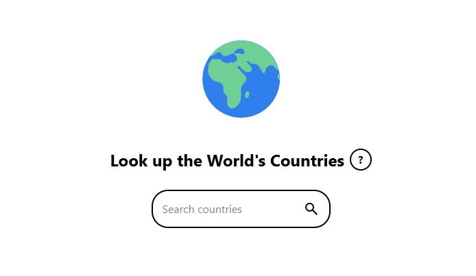

# Country Search App

A small React app to search for countries and view their flag, currency, and
driving side.



**Stack:** React 19, TypeScript, Vite, Tailwind CSS v4

## Running Locally

**Prerequisites:** Node.js v24+ (tested with v24.15.0), npm

1. Clone and install dependencies:

   ```bash
   git clone <repo-url>
   cd simple-country-search-app
   npm install
   ```

2. Get an API key. This app uses the [REST Countries](https://restcountries.com)
   v5 API, which requires auth. Sign up for a free account there to get an API
   key (the free tier has a rate limit).

3. Configure your environment:

   ```bash
   cp .env.example .env
   ```

   Then edit `.env` and set your key:

   ```
   VITE_REST_COUNTRIES_API_KEY=your_api_key_here
   ```

4. Start the dev server:

   ```bash
   npm run dev
   ```

Other available scripts:

- `npm run build` — type-check and build for production
- `npm run preview` — preview the production build locally
- `npm run lint` — run ESLint

## Features

- **Search countries by name** — type 2+ characters to search; results are
  debounced (see trade-offs below) or you can press Enter to search
  immediately.
- **Infinite scroll results** — the dropdown auto-loads more results as you
  scroll near the bottom, with loading skeletons, an error state, and a
  "no results" state.
- **Shareable search links** — the current search query is synced to the URL
  (`?name=...`), so a search can be refreshed or shared and reload the same
  results.
- **Country detail view** — shows the official name, flag (falls back to a
  placeholder image if it fails to load), currency/currencies, and which side
  of the road the country drives on.
- **Accessible instructions modal** — a "How to use this site" modal reachable
  from the `?` button; focus moves into it on open, Escape closes it, and
  focus returns to the trigger button on close.

## Technical Decisions & Trade-offs

- **No state management library.** All state is plain `useState`, lifted to
  `App` and passed down via props/callbacks. The app is small enough that
  Redux/Zustand/Context would be overhead without benefit.
- **No routing library.** This is a single page, so the "shareable link"
  behavior is done by hand with `URLSearchParams` and
  `history.replaceState` instead of pulling in React Router.
- **Infinite scroll instead of pagination controls.** Loading more results on
  scroll (via a scroll-distance-from-bottom threshold) felt like a better fit
  for a searchable dropdown than prev/next buttons.
- **Tailwind v4 + TypeScript** for styling and type safety, with types in
  `src/types/countries.ts` mirroring the REST Countries v5 response shape.
- **3-second debounce on search input.** This is longer than a typical
  debounced search (usually ~300-500ms). It's an intentional trade-off to
  conserve calls against the API's rate-limited free tier, at the cost of
  feeling less responsive while typing. Pressing Enter bypasses the debounce
  for an immediate search.
- **API key is exposed client-side.** The key is sent as a Bearer token
  directly from the browser, so it's visible in the Network tab and bundled
  into the built JS — anyone could extract and reuse it against the free-tier
  quota. This is acceptable for a personal/demo project, but a production app
  would need a server-side proxy to keep the key private.
- **No automated tests.** Testing was scoped out for this small personal
  project; verification has been manual. Adding a test runner (e.g. Vitest)
  would be a natural next step if this grew beyond a demo.
